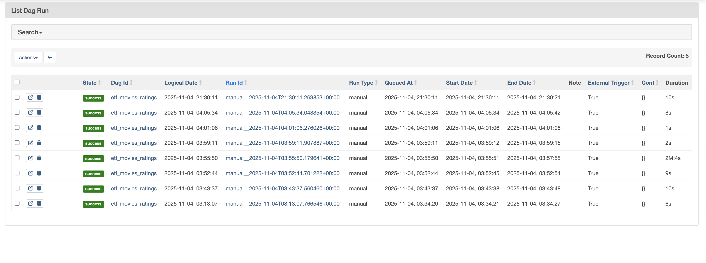
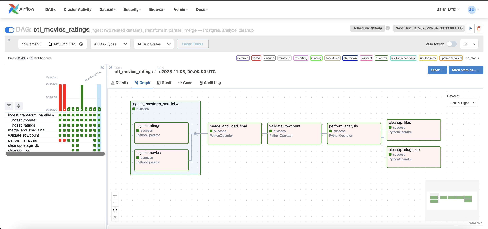

# Week 10 Major Assignment

## Overview
This assignment implements the ETL pipeline using Apache Airflow to process and analyze two related datasets in the airflow-etl folder:  
- `movies.csv` — metadata about movies (ID, title, release year)  
- `ratings.csv` — user ratings for those movies

(I just created these datasets and populated them with data for this project)

The pipeline runs daily and performs the following stages:
1. **Extract & Load** raw data into PostgreSQL staging tables.  
2. **Transform & Merge** the datasets into a single fact table.  
3. **Validate** that the merged table loaded correctly.  
4. **Analyze** the data to compute average ratings per movie and generate a visualization of the top-rated titles.  
5. **Clean Up** temporary staging tables and intermediate files.

---

## DAG Structure

```
ingest_transform_parallel ─▶ merge_and_load_final ─▶ validate_rowcount ─▶ perform_analysis ─▶ [cleanup_stage_db, cleanup_files]
```

### **1. Ingestion (Parallel TaskGroup)**
Two parallel tasks load CSV data into PostgreSQL staging tables:
- `ingest_movies`: Loads movie metadata into `stg_movies`
- `ingest_ratings`: Loads user ratings into `stg_ratings`

### **2. Merge and Load Final Table**
- Joins both staging tables on `movie_id`
- Computes an additional `rating2` field (squared rating)
- Writes the result to a fact table `fact_movie_ratings`

### **3. Validate Row Count**
- Confirms that `fact_movie_ratings` contains rows after merge
- Raises an error if the table is empty

### **4. Perform Analysis**
- Queries PostgreSQL to compute the **average rating** and **count of ratings** for each movie  
- Saves the full results to `/opt/airflow/output/avg_ratings.csv`  
- Plots the **Top 10 Movies by Average Rating** and saves the chart to  
  `/opt/airflow/output/avg_ratings_top10.png`

### **5. Cleanup**
- `cleanup_stage_db`: Drops temporary tables (`stg_movies`, `stg_ratings`)  
- `cleanup_files`: Deletes leftover temporary `.tmp` files and resets `/opt/airflow/tmp/`  

---

## Data Flow

| Step | Source | Destination | Description |
|------|---------|-------------|--------------|
| Extract | `movies.csv`, `ratings.csv` | PostgreSQL staging tables | Raw CSV → DB |
| Transform | `stg_movies`, `stg_ratings` | `fact_movie_ratings` | Merge and add computed fields |
| Validate | `fact_movie_ratings` | Console logs | Ensures data integrity |
| Analyze | PostgreSQL fact table | `/opt/airflow/output/` | Save CSV + Top 10 chart |
| Cleanup | PostgreSQL & filesystem | - | Drop temp tables, delete tmp files |

---

## Key Files
| File | Description |
|------|--------------|
| `dags/etl_movies_ratings.py` | Airflow DAG definition |
| `data/movies.csv` | Movie metadata (100 real titles) |
| `data/ratings.csv` | User ratings (simulated) |
| `output/avg_ratings.csv` | Aggregated movie ratings |
| `output/avg_ratings_top10.png` | Visualization of top 10 movies |

---

## Database Schema

**Table: `fact_movie_ratings`**

| Column | Type | Description |
|--------|------|-------------|
| user_id | int | Unique user ID |
| movie_id | int | Unique movie ID |
| rating | float | User rating (1–5) |
| rating2 | float | Squared rating for derived metrics |
| title | text | Movie title |
| year | int | Release year |

---

## Running Process

1. **Start Airflow containers**
   ```bash
   docker compose up -d
   ```

2. **Access the Airflow UI**
   ```
   http://localhost:8080
   ```

3. **Enable and trigger the DAG**
   - Turn on the toggle for `etl_movies_ratings`
   - Click ▶ “Trigger DAG”

4. **View outputs**
   - Results: `/opt/airflow/output/avg_ratings.csv`
   - Chart: `/opt/airflow/output/avg_ratings_top10.png`

---

## Cleanup
All temporary resources are automatically cleaned up at the end of the DAG:
- PostgreSQL staging tables are dropped
- Temporary `.tmp` files are removed
- `/opt/airflow/tmp/` is reset

---

## Screenshots


